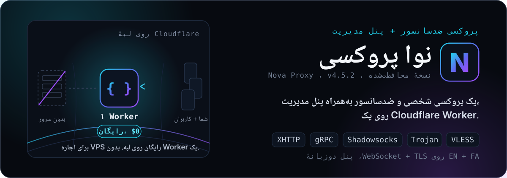
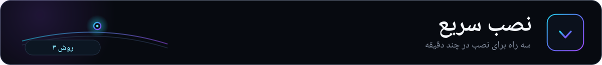
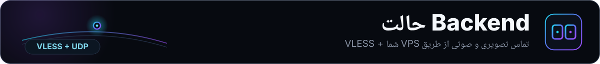

<div align="left">
  <a href="README.md">🇬🇧 English</a>
</div>

<p align="center">
  
</p>

<div align="center" dir="rtl">

**یک پروکسی شخصی و ضدسانسور به‌همراه پنل مدیریت، روی یک Cloudflare Worker.**

VLESS، Trojan، Shadowsocks، gRPC، XHTTP روی WebSocket + TLS، با پنل دوم‌زبانه
(English + فارسی)، بهینه‌سازی IP تمیز به‌تفکیک ISP، حساب چندکاربره، ربات تلگرام،
WARP، زنجیره پروکسی و حالت Backend. اجرا روی **پلن رایگان** Cloudflare.

[](LICENSE)
[](https://github.com/IRNova/Nova-Proxy)
[](https://github.com/IRNova/Nova-Proxy)

</div>

---

## 🌐 لینک‌ها

<div align="center">

[](https://novaproxy.online/)
[](https://t.me/irnova_proxy)
[](https://t.me/irnovaproxy_group)
[](https://www.youtube.com/@novaproxyir)
[](https://x.com/irNovaProxy)
[](https://www.instagram.com/irnova_proxy)

</div>

---

<p align="center">
  
</p>

نوا پروکسی یک **پروکسی شخصی و همه‌کاره برای دور زدن سانسور** است که کاملاً روی Cloudflare Workers، **پلن رایگان**، اجرا می‌شود. این پروژه یک پروکسی قدرتمند (VLESS، Trojan، Shadowsocks روی WebSocket/gRPC/XHTTP) را با **پنل مدیریت کامل دوم‌زبانه** در یک Worker واحد ترکیب کرده است.

**چیزهایی که نوا را متفاوت می‌کند:**
- ⚡ **بدون نیاز به زیرساخت**، بدون VPS، بدون دامنه برای شروع
- 🌍 **IP تمیز به‌تفکیک ISP**، بهینه‌سازی خودکار برای هر اپراتور ایرانی
- 👥 **چندکاربره**، لینک اختصاصی با سهمیه، تاریخ انقضا و کنترل روشن/خاموش
- 🤖 **ربات تلگرام**، مدیریت کامل از طریق تلگرام
- 🔗 **زنجیره پروکسی**، SOCKS5، HTTP، HTTPS، TURN، SSTP
- 🛡️ **دورزدن پیشرفته**، ECH، TLS fragment، 0-RTT، fingerprint
- 🧩 **حالت Backend**، اتصال به VPS شخصی Xray/sing-box برای VLESS + تماس تصویری

---

<p align="center">
  
</p>

روش مورد نظر خود را انتخاب کنید:

### 🖥️ Nova Wizard (دسکتاپ)

نرم‌افزار رسمی دسکتاپ با رابط گرافیکی، بدون نیاز به دانش فنی.

[**→ دانلود Nova Wizard برای ویندوز و لینوکس**](https://github.com/IRNova/Nova-Wizard)

### 🌐 راهنمای امن نصب

صفحهٔ رسمی Nova هیچ رمز Cloudflare یا API Token دریافت نمی‌کند و شما را به مسیر امن نصب هدایت می‌کند:

[**→ novaproxy.online/setup/**](https://novaproxy.online/setup/)

---

### 📱 موبایل

- **Android:** **رادار** با ویزارد داخلی برای نصب آسان نوا پروکسی روی کلودفلر، به‌زودی منتشر می‌شود.
- **iOS:** در دست توسعه.

---

<p align="center">
  
</p>

Cloudflare Workers نمی‌تواند پروکسی TCP بومی اجرا کند یا ترافیک UDP را مستقیماً مدیریت کند. برای فعال‌سازی این قابلیت‌ها، نوا از **حالت Backend** پشتیبانی می‌کند، ارسال ترافیک به VPS شخصی Xray یا sing-box.

```bash
bash <(curl -fsSL https://raw.githubusercontent.com/IRNova/Tools/main/nova-backend.sh)
```

پس از اجرای نصاب، حالت Backend را در پنل نوا فعال کنید (تنظیمات شبکه → حالت Backend) و آدرس VPS خود را وارد کنید.

---

## 📋 پیش‌نیازها

- یک **حساب Cloudflare** (رایگان) با Workers فعال
- یک **فضای KV** (با دیپلوی یک‌کلیکی خودکار ساخته می‌شود، یا دستی با Wrangler)
- (اختیاری) Node.js v18+ و Wrangler CLI برای تست محلی

---

<p align="center">
  
</p>

| قابلیت / Feature | v1 | v2 | v3 |
|------------------|:--:|:--:|:--:|
| دریافت لینک اشتراک خودکار / Auto subscription link | ✅ | ✅ | ✅ |
| فرمت Base64 / Base64 format | ✅ | ✅ | ✅ |
| Clash / Mihomo | ✅ | ✅ | ✅ |
| sing-box | ✅ | ✅ | ✅ |
| Loon | ✅ | ✅ | ✅ |
| Surge | ✅ | ✅ | ✅ |
| توزیع بار / Load Balancing | ✅ | ✅ | ✅ |
| بررسی سلامت / Health Check | ✅ | ✅ | ✅ |
| تست پینگ / Ping test | ✅ | ✅ | ✅ |
| بهترین کانفیگ / Best config | ✅ | ✅ | ✅ |
| QR Code | ✅ | ✅ | ✅ |
| نمایش لیست کانفیگ / Display config list | ✅ | ✅ | ✅ |
| پروکسی DoH / DoH proxy | ✅ | ✅ | ✅ |
| رمزگذاری DNS / DNS encryption | ✅ | ✅ | ✅ |
| Load Balance / Failover / Caching DNS | ✅ | ✅ | ✅ |
| DNS محلی / Local DNS | ✅ | ✅ | ✅ |
| دور زدن تحریم DNS / Anti Sanction DNS | ✅ | ✅ | ✅ |
| IP جعلی / Fake DNS | ✅ | ✅ | ✅ |
| مسیریابی / GeoIP / GeoSite / Routing | ✅ | ✅ | ✅ |
| اتصال مستقیم به سایت ایرانی / Domestic Bypass | ✅ | ✅ | ✅ |
| پشتیبانی IPv6 / IPv6 support | ✅ | ✅ | ✅ |
| مسدودسازی تبلیغات و بزرگسال / AdBlock + PornBlock | ✅ | ✅ | ✅ |
| پورت‌های کلادفلیر / Cloudflare ports | ✅ | ✅ | ✅ |
| لینک مستقیم Trojan / Trojan direct link | ✅ | ✅ | ✅ |
| لینک مستقیم Clash / Clash direct link | ✅ | ✅ | ✅ |
| حالت سراسری SOCKS5 / Global SOCKS5 mode | ✅ | ✅ | ✅ |
| حالت سراسری HTTP / Global HTTP mode | ✅ | ✅ | ✅ |
| اسکن IP تمیز / Clean Cloudflare IP scanner | ✅ | ✅ | ✅ |
| نوتیفیکیشن تلگرام / Telegram notifications | ✅ | ✅ | ✅ |
| مدیریت ربات تلگرام / Telegram bot management | ✅ | ✅ | ✅ |
| Quantumult X | ➖ | ✅ | ✅ |
| تشخیص خودکار کلاینت / Mixed Auto | ➖ | ✅ | ✅ |
| Random Path / Wildcard Host | ➖ | ✅ | ✅ |
| پنل مدیریت فارسی (RTL) / Admin dashboard | ➖ | ✅ | ✅ |
| حالت ساده و پیشرفته / Simple + Advanced mode | ➖ | ✅ | ✅ |
| تم تاریک / Dark mode | ➖ | ✅ | ✅ |
| ویرایشگر JSON / JSON Config Editor | ➖ | ✅ | ✅ |
| مشاهده لاگ / Log Viewer | ➖ | ✅ | ✅ |
| بازنشانی تنظیمات / Reset config | ➖ | ✅ | ✅ |
| VLESS + Trojan + Shadowsocks | ➖ | ✅ | ✅ |
| gRPC + XHTTP transport | ➖ | ✅ | ✅ |
| WebSocket Early Data | ➖ | ✅ | ✅ |
| mux=0 برای Shadowsocks | ➖ | ✅ | ✅ |
| زنجیره SOCKS5 / SOCKS5 chain | ➖ | ✅ | ✅ |
| زنجیره HTTP/HTTPS CONNECT | ➖ | ✅ | ✅ |
| زنجیره TURN + SSTP | ➖ | ✅ | ✅ |
| حالت سراسری HTTPS / TURN / SSTP | ➖ | ✅ | ✅ |
| لیست سفید دامنه / Whitelist domains | ➖ | ✅ | ✅ |
| زنجیره در لینک اشتراک / Chain in sub link | ➖ | ✅ | ✅ |
| TLS 1.3 / 1.2 | ➖ | ✅ | ✅ |
| ChaCha20-Poly1305 / AES-GCM | ➖ | ✅ | ✅ |
| ClientHello سفارشی / ALPN | ➖ | ✅ | ✅ |
| SNI fragment / TLS fragment | ➖ | ✅ | ✅ |
| بازگشت به ChaCha20 / Fallback to ChaCha20 | ➖ | ✅ | ✅ |
| AES-128/256-GCM (Shadowsocks) | ➖ | ✅ | ✅ |
| تشخیص خودکار / کلید جلسه پویا | ➖ | ✅ | ✅ |
| بهینه‌سازی آنلاین / API / لیست IP دلخواه | ➖ | ✅ | ✅ |
| تولید IP تصادفی / دسته‌بندی نتایج | ➖ | ✅ | ✅ |
| ذخیره و جایگزینی نتایج / Save/Override | ➖ | ✅ | ✅ |
| بهینه‌سازی IP به‌تفکیک ISP / Per-ISP clean-IP | ➖ | ✅ | ✅ |
| Webhook تلگرام / تنظیمات ربات در پنل | ➖ | ✅ | ✅ |
| مشاهده مصرف Cloudflare / API Token | ➖ | ✅ | ✅ |
| API مصرف سفارشی / Custom Usage API | ➖ | ✅ | ✅ |
| لینک مستقیم VLESS + Shadowsocks | ➖ | ✅ | ✅ |
| اشتراک با توکن / Subscription with token | ➖ | ✅ | ✅ |
| کپی یک‌کلیک / Full clipboard copy | ➖ | ✅ | ✅ |
| فضای KV (Config, CF, TG, IPs, Logs) | ➖ | ✅ | ✅ |
| ورود با رمز / Auth Cookie | ➖ | ✅ | ✅ |
| اعتبارسنجی UUID / Token Auth (MD5) | ➖ | ✅ | ✅ |
| مسدودسازی speed test / Speed test block | ➖ | ✅ | ✅ |
| متغیرهای محیطی / Environment variables | ➖ | ✅ | ✅ |
| پنل واکنش‌گرا فارسی / Persian RTL responsive | ➖ | ✅ | ✅ |
| نقشه Leaflet / Toast / Modal | ➖ | ✅ | ✅ |
| ماژول‌های جمع‌شونده / SVG icons | ➖ | ✅ | ✅ |
| کپی به کلیپ‌بورد / Copy to clipboard | ➖ | ✅ | ✅ |
| TCP همزمان / 0-RTT / Concurrent TCP dial | ➖ | ✅ | ✅ |
| تجمیع آپلود / داونلود / Uplink/downlink | ➖ | ✅ | ✅ |
| محدودیت صف آپلود / Upload queue limit | ➖ | ✅ | ✅ |
| Load Balance IP / Proxy Fallback | ➖ | ✅ | ✅ |
| لینک اشتراک بدون توکن با فرمت نام‌گذاری شده | ➖ | ➖ | ✅ |
| آینه دائمی گیتهاب برای اشتراک | ➖ | ➖ | ✅ |
| پنل یکپارچه (Static Assets) | ➖ | ➖ | ✅ |
| رابط کاربری دوم‌زبانه + تور راهنما | ➖ | ➖ | ✅ |
| مسدودسازی بدافزار / فیشینگ / Cryptominers | ➖ | ➖ | ✅ |
| مسدودسازی QUIC | ➖ | ➖ | ✅ |
| حالت Backend (VLESS + UDP / تماس تصویری) | ➖ | ➖ | ✅ |
| ECH (رمزنگاری SNI) | ➖ | ➖ | ✅ |
| Port-spread / Multi-transport | ➖ | ➖ | ✅ |
| اعلام خودکار به‌روزرسانی دامنه در تلگرام | ➖ | ➖ | ✅ |
| نمودار ترافیک روزانه + تفکیک آپلود/دانلود | ➖ | ➖ | ✅ |
| لینک اختصاصی کاربر + سهمیه کل/روزانه + انقضا + روشن/خاموش + غیرفعال خودکار | ➖ | ➖ | ✅ |
| لینک اشتراک کاربر با نام کاربری + کلید مخفی | ➖ | ➖ | ✅ |
| کش خواندن-پس-از-نوشتن KV برای انتشار آنی تنظیمات | ➖ | ➖ | ✅ |
| پشتیبانی NAT64 / انتقال IPv6 | ➖ | ➖ | ✅ |
| تغییر رمز پنل + ۲ مرحله‌ای (TOTP) + کد بازیابی | ➖ | ➖ | ✅ |
| محدودیت تلاش ورود + مدیریت نشست | ➖ | ➖ | ✅ |
| ثبت حساب WARP + لایسنس WARP+ + WoW | ➖ | ➖ | ✅ |
| تغییر endpoint WARP + نقاط ایران | ➖ | ➖ | ✅ |
| حالت Amnezia WARP + WARP Noise | ➖ | ➖ | ✅ |
| حالت یک‌کلیک ایران + گزارش زنده کانفیگ | ➖ | ➖ | ✅ |
| پشتیبان‌گیری و بازیابی کامل تنظیمات | ➖ | ➖ | ✅ |
| بازگشت میان‌افزاری (گره‌های غیر Cloudflare) | ➖ | ➖ | ✅ |
| استخر دامنه خودترمیم + بررسی سلامت | ➖ | ➖ | ✅ |
| عبور از کشورها (چین، روسیه، تحریم‌ها) | ➖ | ➖ | ✅ |
| قوانین مسیریابی سفارشی | ➖ | ➖ | ✅ |
| API مدیریت متمرکز + آمار ناوگان + اعلان همگانی | ➖ | ➖ | ✅ |
| خاموش کن سراسری (Kill switch) | ➖ | ➖ | ✅ |
| ضربان قلب نمونه + سامانه اعلان‌ها | ➖ | ➖ | ✅ |
| پایگاه داده D1 (انتقال از KV) | ➖ | ➖ | ✅ |
| ویزارد نصب /install + دیپلوی یک‌کلیکی | ➖ | ➖ | ✅ |

---

<p align="center">
  
</p>

اگر نوا برایتان مفید بود، لطفاً با یک **⭐ ستاره** و یک دونیت کوچک از ادامه‌ی کار حمایت کنید.

<div align="center">

### ⭐ [به نوا در گیتهاب ستاره بدهید](https://github.com/IRNova/Nova-Proxy) ⭐

[](https://github.com/IRNova/Nova-Proxy)

| ارز دیجیتال | آدرس |
|-------------|------|
| **TON** | `UQD51lGC35rP_SbVYgbFA7CEEii4GVMFgqj4N8fiGi6m425w` |

---

## 🙏 تشکر

ساخته شده با ❤️ برای اینترنت آزاد و باز.

- [@iiviirv](https://github.com/iiviirv)، مشارکت‌کننده
- [Cloudflare Workers](https://workers.cloudflare.com/)
- [Xray-core](https://github.com/XTLS/xray-core)

---

## 📜 شرایط: رایگان است و برای فروش نیست

نوا به‌صورت **نسخهٔ محافظت‌شده** منتشر می‌شود: مخزن عمومی فقط فایل استقرار ⁦`worker.js`⁩ (کوچک‌سازی و مبهم‌سازی‌شده) و دادهٔ استقرار آن را دارد و سورس قابل‌نگهداری پنل خصوصی می‌ماند. این همان مدل **«پنل محافظت‌شده، ابزارها باز»** است: پنل محافظت می‌شود، اما ابزارهای پیرامونی (کلاینت‌ها، ⁦Nova Radar⁩ و کمک‌ابزارهای تأییدشده) باز می‌مانند. نوا یک **سرویس رایگان** است، پس شرایط زیر برای نام نوا و کانفیگ‌هایی که می‌سازد اعمال می‌شود:

- **نفروش.** کانفیگ‌ها، اشتراک‌ها یا دسترسی نوا را به‌عنوان محصول پولی نفروش. نوا برای همه رایگان است.
- **نشان سرویس رایگان را حذف نکن.** هر نودِ ساخته‌شده یک نشان قفل‌شدهٔ `سرویس رایگان نوا @irnova_proxy` دارد. حذف آن برای جا زدن کانفیگ‌ها به‌عنوان سرویس پولی خودت مجاز نیست.
- **اعتبار را نگه دار.** اگر فورک یا بازتوزیع می‌کنی، اعتبار نوا پروکسی و لینک به این ریپازیتوری را نگه دار.
- **جعل هویت نکن.** از نام، لوگو یا کانال نوا برای جا زدن یک نسخهٔ ری‌برندشده به‌عنوان نوای رسمی استفاده نکن.

مبهم‌سازی، کپی و فروش مجدد را دشوار می‌کند، اما صادقانه بگوییم کد را بازیابی‌ناپذیر نمی‌کند: شما ورکر را روی حساب ⁦Cloudflare⁩ خودتان مستقر می‌کنید و صاحب هر حساب همیشه می‌تواند ورکرِ درون حساب خودش را بررسی کند. ما ادعای «۱۰۰٪ امن» یا بازیابی‌ناپذیری نمی‌کنیم. نام، برند نوا و وعدهٔ «رایگان ماندن» متعلق به پروژه است.

---

## مجوز

نسخه‌های نوا تا ⁦4.2.0⁩ تحت ⁦MIT⁩ منتشر شدند و همان اجازهٔ تاریخی برای آن نسخه‌ها پابرجاست. از ⁦4.3.0⁩ به بعد، تغییرات نوا تحت ⁦PolyForm Noncommercial⁩ (غیرتجاری) است؛ فایل [LICENSE](LICENSE) را برای شرایط دقیق ببینید. پس پنل دیگر «⁦MIT⁩» یا کاملاً متن‌باز نیست. شرایط برند بالا برای نام و سرویس نوا اعمال می‌شود.

---

<div align="center">

ساخته شده برای ایران ، و هرکس که به اینترنت آزاد نیاز دارد.
**هیچ اطلاعاتی از ترافیک شما ذخیره نمی‌شود. پروکسی متعلق به خود شماست.**

📖 [نسخه انگلیسی / English version](README.md)

---
<a href="https://star-history.com/#IRNova/Nova-Proxy&Date">تاریخچهٔ ستاره‌ها</a>
</div>

---

<div align="center">

ساخته شده توسط <a href="https://github.com/iiviirv"><b>@iiviirv</b></a> برای گروه نوا پروکسی.

</div>
