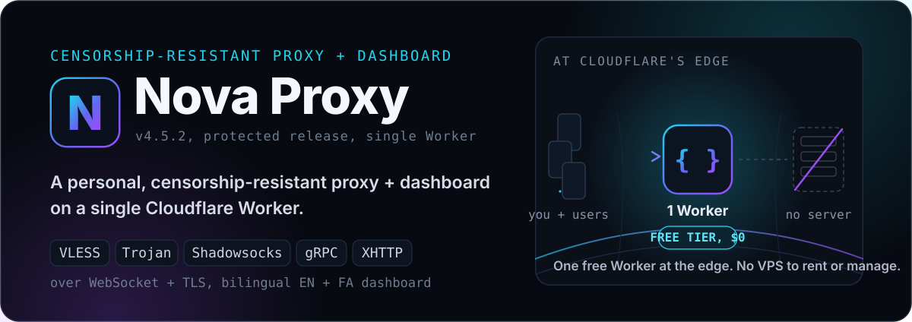

<div align="center">

<div align="right">
  <a href="README.fa.md">🇮🇷 فارسی</a>
</div>



**Your own censorship-resistant proxy with a full admin panel, on a single Cloudflare Worker.**

VLESS, Trojan, Shadowsocks, gRPC, XHTTP over WebSocket + TLS, with a bilingual panel
(English + فارسی), per-ISP clean-IP optimization, multi-user accounts, a Telegram bot,
WARP, proxy chaining, and a Backend mode. Runs on Cloudflare's **free plan**.

[](LICENSE)
[](https://github.com/IRNova/Nova-Proxy)
[](https://github.com/IRNova/Nova-Proxy)

</div>

---

## 🌐 Links

<div align="center">

[](https://novaproxy.online/)
[](https://t.me/irnova_proxy)
[](https://t.me/irnovaproxy_group)
[](https://www.youtube.com/@novaproxyir)
[](https://x.com/irNovaProxy)
[](https://www.instagram.com/irnova_proxy)
[](https://deploy.workers.cloudflare.com/?url=https://github.com/IRNova/Nova-Proxy)

</div>

---

## What it is

Nova Proxy is a control panel and edge worker that runs on Cloudflare Workers. You deploy it to **your own** free Cloudflare account, so the bandwidth, the domain, and the data are all yours. There is no shared server and no middleman. It is built to be a free, high-quality tool, not a reseller platform.

The panel gives you a clean dashboard (English, فارسی, and Русский) to create users, hand each person their own subscription link, and keep everyone connected on networks that actively filter traffic.

## Features

- **Multi-user management** with per-user quota, expiry, daily limits, and one private link each.
- **Resistance Policy** presets: routing tuned for Iran and other high-censorship networks (port spread, domestic bypass, ad and tracker blocking, and more), each with a plain-language on/off.
- **Nova Radar**: an in-browser scanner that finds the fastest clean Cloudflare IPs for the current network and applies them in one click, per user.
- **Universal config formats**: every user link works as Auto, Base64, or Clash, so it imports into almost any client.
- **Calls support**: optional WARP node for FaceTime, WhatsApp, and Telegram calls (UDP), plus a backend mode for full-quality routing through your own server.
- **Mixed protocol**: hand out one link that carries both VLESS and Trojan, so if a filter blocks one, the app keeps working on the other.
- **GitHub mirror failover**: publishes your subscription to a GitHub repo so users keep a permanent `raw.githubusercontent.com` link even if your domain gets filtered.
- **Telegram bot control**: manage users (add, edit, quota, expiry, extend, delete) straight from a bot, in EN, FA, or RU.
- **Node name templates**: brand every node name with a template ({FLAG} {COUNTRY} {CITY} {NAME} {DATE} and more).
- **Self-healing links**: if your worker domain changes or a host goes down, configs fall back to a working address on their own.

## Quick start

You need a free [Cloudflare](https://dash.cloudflare.com/sign-up) account.

**Option A, one-click:** use the Deploy to Cloudflare button above and follow the prompts. Cloudflare's supported deployment flow creates the Worker, the KV namespace, and the D1 database, then connects Workers Builds. You do not create or paste a Cloudflare API token into Nova.

**Option B, Telegram bot:** the installer bot [@IRNovaProxy_Bot](https://t.me/IRNovaProxy_Bot) can do the whole deployment from your phone.

**Option C, Wrangler (CLI):**

```bash
# 1. install the Cloudflare CLI
npm install -g wrangler
wrangler login

# 2. install dependencies and deploy
# Wrangler provisions and binds KV and D1 automatically.
npm ci
npm run deploy
```

After it deploys, open `https://<your-worker>.workers.dev/admin`, finish the short setup, and set your admin login. That is your panel.

Full deployment, verification, and update instructions are in [DEPLOY.md](DEPLOY.md).

### Easy, reviewable updates

Repositories created from this project include a daily **Check for Nova updates** GitHub Action. When a release is available, it opens a pull request containing only `worker.js` and `version.json`. Review the diff and Cloudflare preview, then merge to deploy through Workers Builds. Nontechnical users can optionally enable validated hands-off updates with one repository variable. See [DEPLOY.md](DEPLOY.md) for review mode, automatic mode, and rollback instructions.

## Using it

1. Open the panel and turn on multi-user.
2. Create a user (name, quota, expiry). The panel generates their private link.
3. Copy that user's link and send it to them.
4. They open it on their phone, pick **Auto**, **Base64**, or **Clash**, and import it into their app.

The recommended client is **[Nova Client](https://github.com/IRNova/Nova-Client)** (iOS, Android, and desktop). Any standard client that reads Base64 or Clash also works.

## Clients

| Format | Works with |
| --- | --- |
| Auto | Most apps, picks the right format automatically |
| Base64 | v2rayNG and classic apps |
| Clash | Clash Meta, FlClash, Karing |

## Release notes

The latest release is **4.5.2**: token-based subscription links, a stable per-user TLS fingerprint, a Resistance Policy trimmed to the toggles that actually work (QUIC now drives the real block), Exit Location removed, lighter connection accounting, and a release build that boots the artifact before shipping.

Full history is in [RELEASE_NOTES.md](RELEASE_NOTES.md).

## Notes

- **This is self-hosted.** Each person runs their own panel on their own free Cloudflare account, so it scales without any shared cost.
- **Free Cloudflare limits apply.** Calls use UDP, which a plain free Worker cannot carry. Enable the WARP node or a backend server for voice and video calls.
- **Keep the panel private.** Do not share your admin login. User subscription links are credentials, treat them like passwords.
- Nova Proxy is a free tool for open access to the internet. Use it responsibly and in line with the laws that apply to you.

## Source and license

Nova ships as a protected release. The public repository holds a minified and obfuscated `worker.js` deployment artifact plus its deployment metadata. The maintainable panel source is kept private. This is the "protected panel, open tools" model: the panel itself is protected, while the tools around it (the client apps, Nova Radar, and the verified helpers) stay open.

The protection is there to deter copying and resale. To be honest about what it does and does not do: it does not make the code impossible to recover. You deploy the Worker to your own Cloudflare account, and a Cloudflare account owner can always inspect a Worker running in their own account. We do not claim it is unrecoverable or "100% secure".

On licensing: Nova releases through 4.2.0 were published under the MIT license, and that historical grant still stands for those versions. Starting with 4.3.0, Nova-authored changes are under PolyForm Noncommercial. You can self-host, study, and modify Nova for noncommercial use, but reselling access or running paid hosting is not permitted without written permission. So the panel is no longer MIT or fully open source. See the [LICENSE](LICENSE) file for the exact terms.

---

<div align="center">

Built for Iran , and everyone who needs an open internet.

**None of your traffic is logged. The proxy is yours.**

📖 [نسخهٔ فارسی / Persian version](README.fa.md)

<a href="https://star-history.com/#IRNova/Nova-Proxy&Date">Star history</a>

</div>
